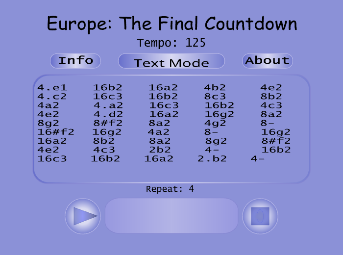

# 🎵 RetroTone Player

**Year:** 2003

**Built with:** Macromedia Flash MX & ActionScript

**Live Demo:** [🔗 https://demo.repulsivecoder.pro/retro-tone-player/](https://demo.repulsivecoder.pro/retro-tone-player/)

---

## 🕹️ Overview

**RetroTone Player** is a Flash-based mobile ringtone player that brings the early 2000s era of mobile music back to life.
It interprets text-based ringtone sequences (for example: `8e2 16c2 8d2 16f2 2e2 8e2 8d2 16e2`) and plays them back as real melodies.

Originally created as a personal project (Upgraded to a web based version from my **Iutcafe project in C**), it showcased how text-encoded music data could be visualized and heard using the capabilities of **Flash MX** and **ActionScript** - long before smartphones and music apps became mainstream.

---

## 🎼 Features

- **Text Notation Playback**
  Plays mobile ringtone note strings in real-time (e.g., `8c2 16d2 8e2 2f2`).

- **Dual View Modes**
  - **Notation Mode:** Displays original text-based notes.
  - **Graphical Mode:** Converts the same notes into standard piano sheet notation.

- **Interactive Flash Interface**
  Simple and nostalgic design built entirely in **Macromedia Flash MX (2003)**.

---

A nostalgic experiment in blending text, sound, and visuals, RetroTone Player demonstrated how Flash MX and ActionScript could turn simple tone strings into expressive, playable melodies - capturing the charm of early mobile music creation.
